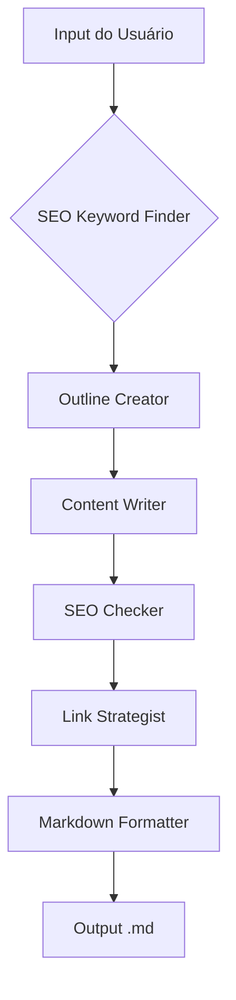

# 🚀 SEO Content Factory

.svg)  
*Sistema automatizado para criação de posts de blog otimizados para SEO com IA*


## 🌟 Recursos Principais
- **🤖 6 Agentes Especializados**  
  Pesquisa de keywords, estruturação, redação, otimização SEO, estratégia de links e formatação
- **🎨 Controle de Tom**  
  Escolha entre 4 estilos: Profissional, Descontraído, Técnico ou Persuasivo
- 🔍 Integração com Ferramentas SEO  
  Pesquisa em tempo real via Serper API
- 📈 Fluxo de Produção Completo  
  Do planejamento estratégico ao markdown pronto para publicação
- 📝 Personalização Avançada  
  Adição de palavras-chave complementares e parametrização detalhada
- 📤 Exportação Automática  
  Geração de arquivo .md com formatação profissional

## 🏗️ Arquitetura do Sistema

### 👥 Agent Specialists
| Agente                | Função Principal                          | Ferramentas         |
|-----------------------|-------------------------------------------|---------------------|
| SEO Keyword Finder    | Pesquisa estratégica de keywords          | Serper API, Análise |
| Outline Creator       | Estruturação hierárquica do conteúdo      | Templates SEO       |
| Content Writer        | Redação com tom personalizado             | Modelo Gemini       |
| SEO Checker           | Otimização técnica e de legibilidade      | Ferramentas SEO     |
| Link Strategist       | Inserção estratégica de links externos    | Base de dados       |
| Markdown Formatter    | Formatação técnica para publicação        | Guias de estilo     |

### 📋 Fluxo de Trabalho


## 🛠️ Estrutura do Projeto

```
seo-blog-factory/
├── app.py               # Interface Streamlit
├── main.py              # Versão CLI
├── crew.py              # Configuração dos Agents/Tasks
├── requirements.txt     # Dependências
└── config/
    ├── agents.yaml      # Configurações dos Agents
    └── tasks.yaml       # Definição das Tasks
```

## 📋 Pré-requisitos
- Python 3.10+
- [Serper API Key](https://serper.dev/)
- Gemini ou LLM alternativo
- Streamlit 1.36+

## 🚀 Começando

1. Clone o repositório:
```bash
git clone https://github.com/seu-usuario/seo-blog-factory.git
cd seo-blog-factory
```

2. Configure o ambiente virtual:
```bash
python -m venv .venv
source .venv/bin/activate  # Windows: .venv\Scripts\activate
```

3. Instale as dependências:
```bash
pip install -r requirements.txt
```

4. Configure as chaves API no arquivo `.env`:
```env
SERPER_API_KEY=sua_chave_aqui
GEMINI_API_KEY=sua_chave_aqui
```

## 🖥️ Como Usar (Interface Web)

1. Inicie o servidor Streamlit:
```bash
streamlit run app.py
```

2. Na interface:
   - Insira o tópico principal
   - Selecione o tom desejado
   - Adicione keywords complementares (opcional)
   - Clique em "🚀 Gerar Post Blog"

3. Acompanhe o processo em tempo real:
   - Visualize cada etapa de produção
   - Pré-visualize o conteúdo gerado
   - Baixe o arquivo .md final

## 🔧 Configuração Avançada

### Personalizando Agents
Edite `config/agents.yaml` para:
- Ajustar goal e backstory
- Modificar parâmetros de execução
- Adicionar novas ferramentas

### Customizando Tasks
Em `config/tasks.yaml` defina:
- Novos critérios de avaliação
- Fluxos de trabalho alternativos
- Parâmetros de saída

## 🤝 Contribuindo
1. Faça um fork do projeto
2. Crie sua branch (`git checkout -b feature/nova-feature`)
3. Commit suas mudanças (`git commit -m 'Adiciona nova feature'`)
4. Push para a branch (`git push origin feature/nova-feature`)
5. Abra um Pull Request

## 📄 Licença
Distribuído sob licença MIT. Veja `LICENSE` para detalhes.

## 🙏 Reconhecimentos
- [CrewAI](https://crewai.com) - Framework de agentes
- [Serper](https://serper.dev) - Ferramentas SEO
- [Streamlit](https://streamlit.io) - Interface web

---
